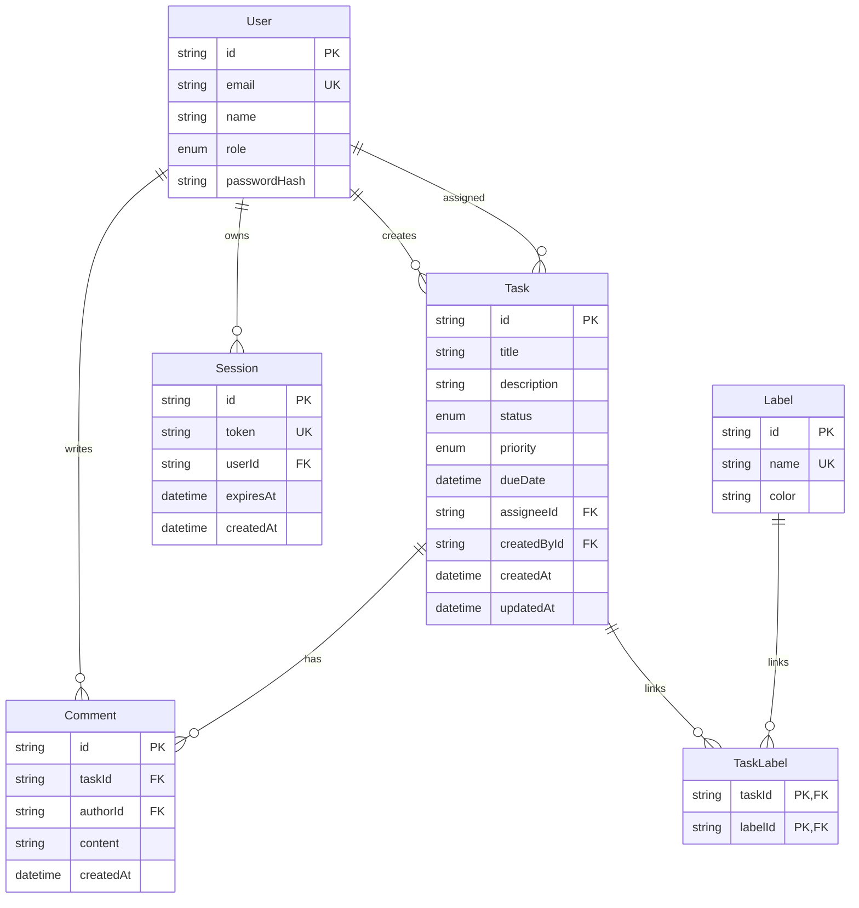

# ER 図

この見本では、ユーザー、タスク、コメント、ラベル、セッションを最小構成で持ちます。

## モデル補足

### User

- `role` は `user` と `admin` の 2 値です。
- 認証は外部プロバイダーではなく、教育用にシンプルなメール + パスワード + セッション Cookie を採用しています。

### Task

- `createdById` と `assigneeId` の 2 つで `User` に関連します。
- `dueDate` は任意です。
- `status` は `todo / in_progress / in_review / done`、`priority` は `low / medium / high / urgent` を使います。

### Comment

- タスク詳細画面だけで扱うようにしており、コメント責務を一覧へ広げていません。

### Label と TaskLabel

- ラベルは多対多なので、中間表 `TaskLabel` を明示しています。
- 教材として「ORM が隠しても、DB には中間表がある」ことを読み取れるようにしています。

### Session

- サーバー側で保持するセッション情報です。
- Cookie には token だけを持たせ、ユーザー情報そのものは入れません。
